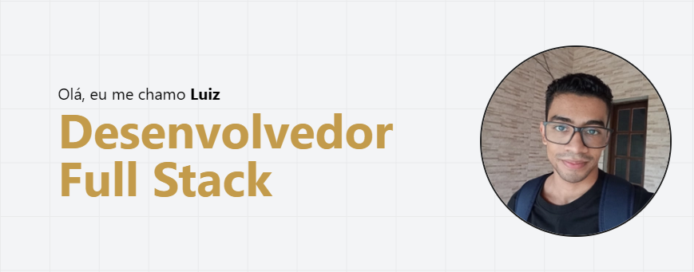

# Portfólio - Luiz Teles

### [Visitar Portfólio](https://luiz2k.vercel.app/)

---

### 📚 Páginas
- **Sobre Mim:** Uma breve explicação sobre mim e um resumo geral das minhas habilidades, serviços e projetos
- **Habilidades:** Conhecimentos que eu tenho com tecnologias front-end e back-end
- **Projetos:** Projetos pessoais que eu já desenvolvi
- **Serviços:** Projetos reais que eu já coloquei no ar
- **Contatos:** Como entrar em contato comigo

### 🛠️ Tecnologias
- **Next.JS:** Framework web que possibilita renderização do lado do servidor e geração de sites estáticos.
- **TypeScript:** Linguagem de programação tipada que é um superconjunto de JavaScript.
- **Tailwind CSS:** Framework CSS baseado em classes utilitárias.
- **Markdown To JSX:** Biblioteca que permite a criação de elementos HTML a partir de um arquivo markdown.
- **Gray Matter:** Biblioteca que possibilita a leitura de metadados de um arquivo markdown.
